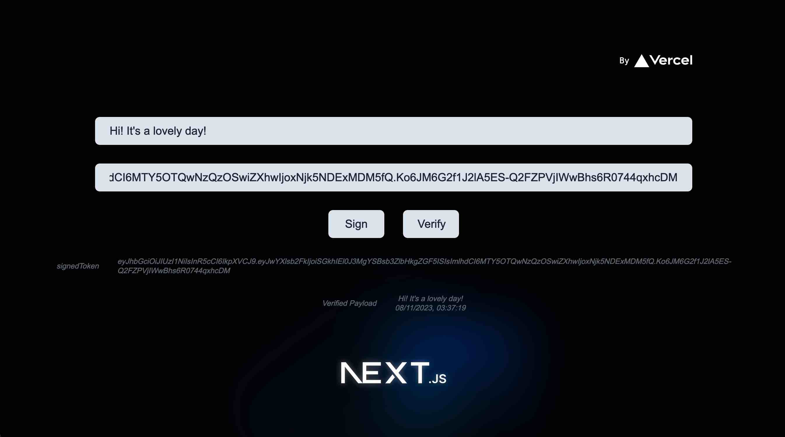

# Payload Message using Server Actions

An example using Next.js 14 with Server Actions to sign a token and verify it natively.

<br/>

<br/>

## Getting Started

- install dependencies

```bash
yarn install
```

- start the server

```bash
yarn dev
```

- open [http://localhost:3000](http://localhost:3000) in your browser

<br/>

### Author: [Mustafa Azim](https://github.com/mazimcoder)
